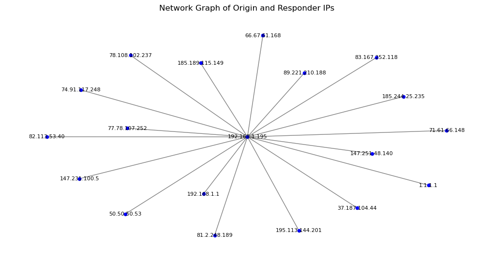
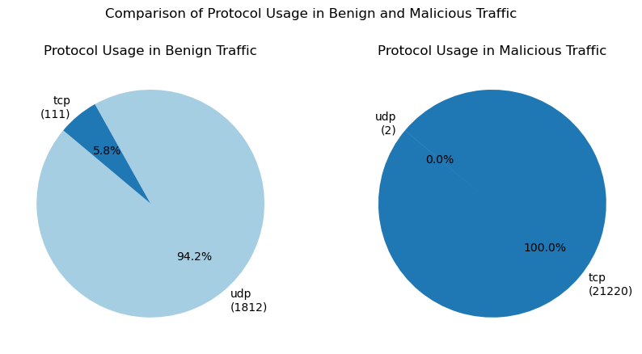
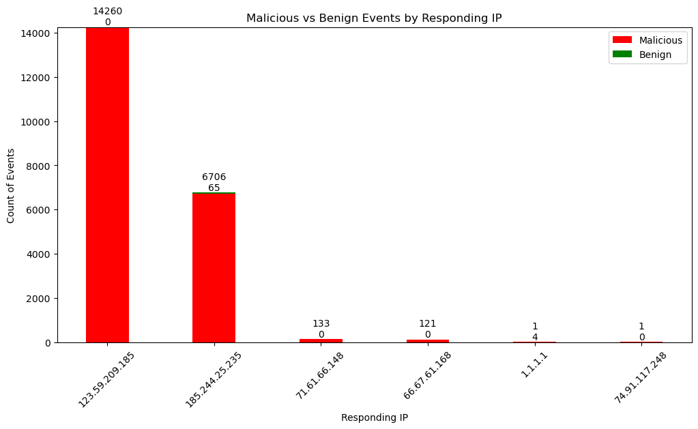

# Network Analysis and DCO Prioritization

This repository contains code and resources for performing predictive analysis of malicious traffic using logs from a poorly configured Intrusion Detection System (IDS). The primary goal (MVP) is to correctly calculate the probability of malicous traffic and test recommended mitigations quantitatively.

An exploratory analysis of the dataset can be found at:

```url
https://github.com/sdave777/Internet-of-Things_IDS_Data
```
## Observations of Data

The dataset has 23,145 observations (rows) and 18 features (columns). It consists of raw observations with details about network connections, allowing for comprehensive data analysis. There many avenues of exploration, most of which are explored in the above repository. These include malicious traffic and its relation to duration, protocol, and connection state; the data flow of network traffic; and the volume of traffic with malicious and benign behavior.

#### Flow of Traffic

It appears that all the data is seen after it passes through a router or firewall. We are unable to see where the traffic comes from, outside of the network, but we are to see which IP addresses within our network are targetted.



#### Protocol Usage

All of the malicious traffic is almost exclusively using the TCP protocol. This is likely due to data validation protocols built into TCP, which can be useful for malicious actors. Similarly, almost all of the benign traffic is using UDP protocol. It may be wise to limit or eliminate, if possible, any TCP traffic if we don't need to use it for this network.



#### Malicious Events by IP

Most of the malicious traffic does target 2 IP addresses. It would be interesting to see what these IP addresses, however, it's safe to assume they are the target of most of the activity.




## Introduction
This project attempts a predictive analysis of malicious traffic using IDS logs. It further aims to test various mitigation strategies to enhance network security. The analyses include:
- Predicting the likelihood of malicious activity based on network traffic data.
- Performing hypothesis tests to determine the effectiveness of different security measures.


## Usage

The project includes several scripts and a FastAPI application for interacting with the predictive model and performing hypothesis tests.

Click the following link for the proof of concept:

[uvicorn API:app](https://network-analysis-and-dco-prioritization.onrender.com/docs#/)

## Predict Malicious Likelihood
A linear regression model was attempted, but it wasn't realistic or working with this type of data. I found that a random forest classifier is the more than situable for this situation, however. It is able to take in multiple variables and provide a probability based on observed behaviors. We are able to factor in malicious likelihood due to protocol (UDP or TCP), duration of connections, type of connections, amount data transfered, port usage and whether similar events were malicious or benign. This should give us a more behavior based prediction and is useful in scenarios such as with an IP address that is rarely used, but necessary to have, and only has malicious traffic logged for it because it is rarely used.


To predict malicious likelihood, click the predict drop-down carrot and enter an IP address that is found on the network in the dataset and it will calculate the probability of malicious traffic.

Suggested IP addresses:
- 185.244.25.235
- 123.59.209.185
- 1.1.1.1
- 147.231.100.5


## Hypothesis Tests

The sample size for both of these is 23,145. This is large enough to give us a power of 99.6%.

### Duration-Based Test
- The null hypothesis (H0): There is no significant difference in malicious likelihood between long and short duration connections.
- The alternative hypothesis (H1): There is a significant difference in malicious likelihood between long and short duration connections.

The /hypothesis/duration endpoint tests whether the duration of connections affects the likelihood of malicious activity.

Click the drop-down carrot for hypothesis duration and enter a time in seconds. This will represent a threshold for a "long" duration of time. If there is a significant difference in malicious likelihood between short and long durations, then it may be wise to limit connections of the given threshold.

This could be applicable in creating rules for network defense that limit connection times, beyond an arbitrary number, this allows the operator to set a rule (how long someone should be allowed to maintain a connection) based on quantifiable analysis of network traffic.

### Protocol-Based Test
- Null Hypothesis (H0): There is no significant difference in the likelihood of malicious traffic between TCP and UDP traffic.
- Alternative Hypothesis (H1): Eliminating TCP traffic and keeping only UDP traffic will reduce the likelihood of malicious traffic.
  
The /hypothesis/protocol endpoint tests whether the type of protocol (TCP/UDP) affects the likelihood of malicious activity.

Click the drop-down carrot for hypothesis protocol. Enter in either UDP or TCP to see if one or the other should be limitted.


## Results

The results of the analysis are documented in the Results section of this repository. Key findings include:
- Significant differences in malicious likelihood between different protocols.
- The impact of connection duration on the likelihood of malicious activity.

## Future Work
Future enhancements could include:

- Integrating additional data sources for a more comprehensive analysis.
- Implementing real-time monitoring and prediction.
- Integrating a hardware/software list or network topology for better predictors.
- Using hardware/software information to predict initial access and possible lateral movement points within the network.
